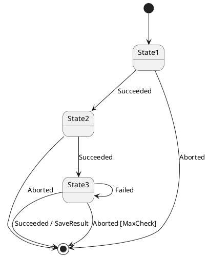
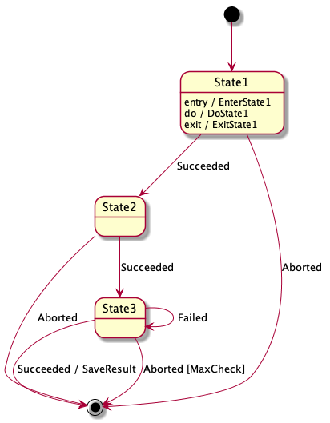

# go-state-machine

Execute state transition operation based on [state machine diagram](https://plantuml.com/state-diagram) defined in [Plant UML](https://plantuml.com/) format.

Currently support only flat (no composite) stat model like:




## usage
1. write plant uml state machine diagram.
    1. Do not define named `shutdown` event since it reserved internal using.
1. write state transition code:
    1. define type to hold action and guard functions.
        1. Prototype of action function is `func() time.Duration` (defined as type `Action`).
        1. Prototype of guard function is `func() bool` (defined as type `Guard`).
        1. Both action and guard function must be started with upper case since they will be called from [reflect package](https://golang.org/pkg/reflect/).
        1. `Shutdown` action have to be implement for reserved event `shutdown`. If not implement, `NewStateMachine` will return error.
    1. generate StateMachine via `NewStateMachine` function with the diagram.
    1. run StateMachine
    1. send Event to StateMachine
    1. Listen StateMachine response when send Shutdown event to StateMachine.

### example

```go
package x
import (
  "fmt"
  "os"
  "time"

  sm "github.com/marrbor/go-state-machine/statemachine"
)

type T struct{
 counter int
 machine *sm.StateMachine
}

// Action functions
func (t *T) SaveResult() time.Duration { return 1 * time.Second }
func (t *T) Shutdown() time.Duration { return 0 }

// Guard functions
func (t *T) MaxCheck() bool { return true }

func main() {
  var t T
  m, err := sm.NewStateMachine(&t, "t.puml") // initial transit to State1
  if err != nil {panic(err)}

  m.Start()
  m.Send(sm.NewEvent("Succeeded")) // transit to State2
  m.Send(sm.NewEvent("Succeeded")) // transit to State3
  m.Send(sm.NewEvent("Aborted"))   // call MaxCheck guard function, if MaxCheck returns true, transit to EndState. 
  m.Stop() // stop state machine
  s := m.Listen() // Wait for stopping machine.
  if s != sm.Stopped {
    panic(fmt.Errorf(s))
  }
  os.Exit(0)
}
```

## Todo 
- Support entry/exit activities in state.

## License
MIT
