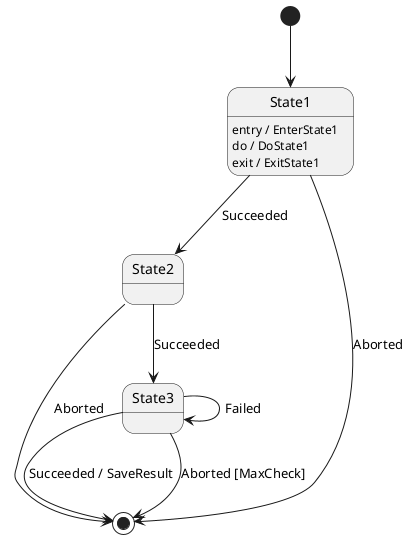

# go-state-machine

Execute state transition operation based on [state machine diagram](https://plantuml.com/state-diagram) defined in [Plant UML](https://plantuml.com/) format.

Currently support only flat (no composite) state model like:




## usage
1. write Plant UML state machine diagram.
1. write state transition code:
    1. Prototype of action function is `func()`
    1. Prototype of guard function is `func() bool`
    1. Prototype of entry/exit function is `func()` (No arguments/No return values).
    1. Prototype of do-function is `func()` (No arguments/No return values).
      - do-function must not break its procedure. when error occurred, logged it.
      - Have to make a `chan string` and set it into the last arguments of `NewStateMachine`.
      - Have to listen this channel in the function.
      - When receive a string (the content is the state name) from this channel, do-function have to do closing procedure and call `FinishDoAction` with state name.
    1. Both action and guard function must be started with upper case since they will be called from [reflect package](https://golang.org/pkg/reflect/).
    1. generate StateMachine via `NewStateMachine` function with the Plant UML state machine diagram.
      - `NewStateMachine` parsed given diagram. When any non implement action and/or guard methods found, `NewStateMachine` will return error.
    1. Start StateMachine with `Run` method.
    1. send Event to StateMachine
    1. Listen StateMachine response when sent event that transit to end state t to StateMachine.

### example

```go
package x
import (
  "fmt"
  "os"
  "time"

  sm "github.com/marrbor/go-state-machine/statemachine"
)

var dq chan string

type T struct{
 counter int
 machine *sm.StateMachine
}

// Action functions
func (t *T) SaveResult() time.Duration { return 1 * time.Second }

// Guard functions
func (t *T) MaxCheck() bool { return true }

// Entry/Exit Functions
func (t *T) EnterState1() {}
func (t *T) ExitState1() {}

// Do Function
func (t *T) DoState1() {
    tq := make(chan error)
    // something to do

    // waiting for action timing or stop message.
LOOP:
    for {
      select {
        case fmsg := <- dq:
          // stop message detect.
  	      response := "State1"
	      if fmsg != response {
	  	    response = fmt.Sprintf("invaild state:%s", fmsg)
	      }
	      t.machine.FinishDoAction(response)
  	      break LOOP
        case tmsg := <- tq:
          // some thing to do. 
      }
    }
}

func main() {
  var t T
  oq := make(chan string)

  m, err := sm.NewStateMachine(&t, "t.puml", 1, oq, dq) // initial transit to State1
  if err != nil {panic(err)}
  m.Run() // do initial transition

  m.Send(sm.NewEvent("Succeeded")) // transit to State2
  m.Send(sm.NewEvent("Succeeded")) // transit to State3
  m.Send(sm.NewEvent("Aborted"))   // call MaxCheck guard function, if MaxCheck returns true, transit to EndState. 
  s := <- oq // Wait for stopping machine.
  if s != sm.Stopped {
    panic(fmt.Errorf(s))
  }
  os.Exit(0)
}
```

## License
MIT
